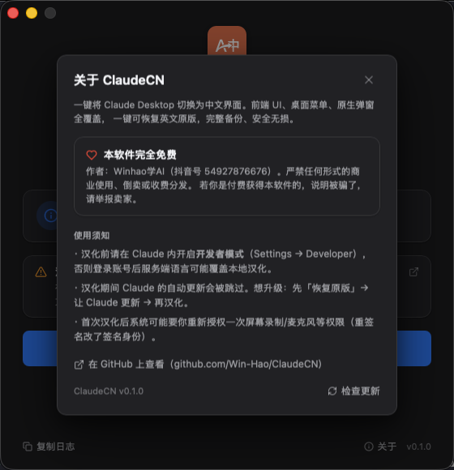

# ClaudeCN — Claude Desktop 中文汉化工具

> **本软件完全免费** | 作者：**Winhao学AI**（抖音号：**54927876676**）
>
> 严禁任何形式的商业使用、倒卖或收费分发。如果你是付费获得本软件的，说明你被骗了，请立即举报卖家。

**🌐 官网体验 → [win-hao.github.io/ClaudeCN](https://win-hao.github.io/ClaudeCN/)**　｜　⬇️ [下载最新版](../../releases/latest)

一键将 Claude Desktop 切换为中文界面，支持 **macOS 与 Windows**。基于 **Tauri v2（Rust + React）**，一套代码、同时出两端安装包。

## 界面预览

| 主界面 | 关于 |
|:---:|:---:|
|  |  |

> 左：自动检测 Claude 版本 / 译文覆盖率 / 备份状态，点「一键汉化」即可 · 右：关于页（作者信息、使用须知、一键检查更新）

## 功能

- **一键汉化** Claude Desktop 界面（前端 UI、桌面菜单、原生弹窗全覆盖）
- **一键恢复** 英文原版（完整备份，安全无损）
- 自动检测 Claude 安装状态、版本、是否已汉化、有无备份
- 实时进度反馈 +「复制日志」便于反馈
- **应用内自动更新**（新版本启动自动提示，一键更新）
- 不修改任何 Claude 核心功能代码

## 翻译覆盖率

- 前端 UI 翻译：**18,000+ 条**精校译文，完整覆盖当前 Claude 的全部 en-US key（~100%）
- 桌面菜单、statsig 实验文案、原生 `Localizable.strings` 一并汉化
- 未翻译的新增 key 自动回退英文（合并时以 en-US 为底，绝不出现哈希乱码）
- 覆盖 Cowork、Connectors、Claude Code、隐私设置等全部新功能

---

## 安装

### macOS

1. 从 [Releases](../../releases) 下载最新的 `.dmg`
2. 打开 DMG，把 **ClaudeCN** 拖进 **Applications** 文件夹
3. 从启动台或 Applications 打开 ClaudeCN

> 安装包已 **Apple 公证（Developer ID 签名 + Notarization）**，双击直接打开，无需再敲 `xattr` 解除限制。

**系统要求**：macOS 13.0 (Ventura) 或更高（Apple Silicon）· 已安装 [Claude Desktop](https://claude.ai/download)

### Windows

1. 从 [Releases](../../releases) 下载 `ClaudeCN_x.y.z_x64-setup.exe`
2. 安装后运行（程序会自动以管理员身份请求提权——Claude 装在受保护目录，必须管理员）
3. 程序自动检测 Claude 安装状态

**系统要求**：Windows 10/11（x64）· 已安装 Claude Desktop（MSIX 或 exe 安装版均支持）· 管理员权限

---

## 使用方法

1. 确保已安装 [Claude Desktop](https://claude.ai/download)
2. **汉化前先开启开发者模式**：在 Claude Desktop 中 **Settings → Developer → 打开开关**（否则登录 Anthropic 账号后服务器端语言设置会覆盖本地汉化，导致界面仍显示英文）
3. 打开 ClaudeCN，点「**一键汉化**」
   - **macOS**：会弹一次系统管理员密码框授权（需要换入修改后的 Claude.app）
   - **Windows**：以管理员身份运行即可
4. Claude Desktop 自动重启为中文界面
5. 如需恢复，点「**恢复英文原版**」即可还原（含防降级保护）

> **关于自动更新**：汉化期间 Claude 自身的自动更新会被跳过（签名校验）。想升级 Claude：先「恢复英文原版」→ 让 Claude 更新 → 再汉化。
> ClaudeCN **自己**的更新是应用内自动的，与上面无关。

---

## 从源码构建

新版 GUI 在 [`gui-tauri/`](gui-tauri/)（Tauri v2 + React + TypeScript + Rust）。

```bash
cd gui-tauri
npm install
npm run tauri dev      # 开发：起一个带热重载的窗口
```

发布（本地出签名+公证的 `.dmg` 并传 GitHub Releases，含自更新清单）见 [`gui-tauri/SIGNING.md`](gui-tauri/SIGNING.md)：

```bash
cd gui-tauri
bash scripts/build-mac.sh        # 编译 + Developer ID 签名 + 公证 + 自更新产物
bash scripts/gen-latest-json.sh  # 生成更新清单 latest.json
bash scripts/release-mac.sh      # 发布到 GitHub Releases
```

> 汉化逻辑的「真相源」是 [`skills/claude-localize/`](skills/claude-localize/)（Claude 桌面端 i18n 机制 + 精校译文 + 自增长翻译流程）。GUI 是消费端：把 skill 维护的 `zh-CN.base.json` 打包进去。Claude 出新版、新增英文文案时，由维护者跑该 skill 翻译增量、回灌进 GUI 再发版。

---

## 工作原理

1. **备份**原版（macOS 用 `ditto` 打包整个 Claude.app；Windows 备份会被改动的 `index-*.js`）
2. 把中文译文写进 Claude 的 i18n 文件——**尤其覆盖 `en-US.json`**（实际生效的 locale 常被账号/服务端定为 en-US 并回写，故覆盖 en-US 最稳；未译 key 已回退英文，不丢兜底），并写 `zh-CN.json` / `zh.json`
3. 汉化桌面菜单层（`Contents/Resources/<locale>.json` + `Localizable.strings`）
4. 语言白名单：旧版 Claude 在 `index-*.js` 里有硬编码语言数组时注入 `zh-CN`；新版改为动态加载，自动跳过
5. 把语言偏好写进 Claude 所有数据目录的 `config.json`（含接入第三方/自定义模型时用的 `Claude-3p`）
6. **macOS 额外**：ad-hoc 重签名——剥掉绑定 Team ID/Apple 授权的 entitlements（否则新版 macOS 启动拒绝），保留摄像头/麦克风/截屏等能力。**Windows 无需签名**，提权直接改文件

## 安全性

- 自动备份原始文件，Claude 更新后按版本自动重新备份；恢复带**防降级保护**
- 备份就算误删也不要紧：Claude.app 可从 [claude.ai](https://claude.ai/download) 免费重装即恢复官方原版；聊天记录与登录在 `~/Library/Application Support/Claude/`（与 app 分开存），重装不丢
- 不修改任何 Claude 核心功能代码，不收集任何用户数据

---

## Star 趋势

如果这个工具帮到了你，欢迎点个 ⭐ **Star** 支持一下 —— 这是对作者最大的鼓励，也能让更多需要的人发现它。

[](https://star-history.com/#Win-Hao/ClaudeCN&Date)

## 作者

**Winhao学AI**（抖音号：**54927876676**）— 欢迎关注获取更多 AI 工具和教程。

## 声明

- 本项目为社区开源工具，与 Anthropic 公司无关，非官方产品。
- **本软件完全免费，严禁任何形式的商业使用**（出售、收费分发、作为付费服务的一部分等均不允许）。
- 如果你是通过付费渠道获得本软件的，你被骗了！请举报卖家并从本仓库免费下载。

## 许可证

[CC BY-NC 4.0](LICENSE)（署名-非商业性使用）
