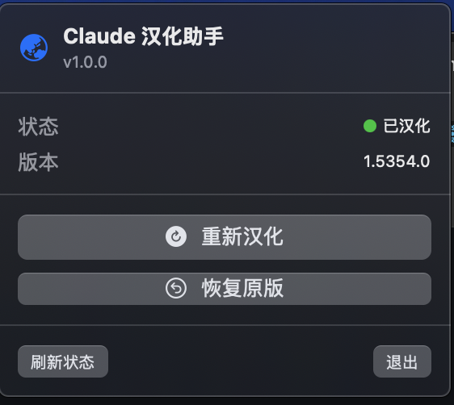

# ClaudeCN - Claude Desktop 汉化助手

> **本软件完全免费** | 作者：**Winhao学AI**（抖音号：**54927876676**）
>
> 严禁任何形式的商业使用、倒卖或收费分发。如果你是付费获得本软件的，说明你被骗了，请立即举报卖家。

一键将 Claude Desktop 切换为中文界面，支持 macOS 和 Windows。



## 功能

- 一键汉化 Claude Desktop 界面（前端、桌面端、原生菜单）
- 一键恢复原版（完整备份，安全无损）
- 自动检测 Claude Desktop 安装状态和汉化状态
- 实时显示处理进度
- 不修改任何 Claude 核心功能代码

## 翻译覆盖率

- 前端 UI 翻译：13,800+ 条（完整覆盖 en-US 全部 key）
- 桌面菜单翻译：355 条
- 功能特性描述翻译：46 条
- 覆盖 Cowork、Connectors、Claude Code、隐私设置等全部新功能

---

## macOS 版

基于 Swift + SwiftUI，菜单栏常驻应用。

### 安装

#### 方式一：DMG 安装（推荐）

1. 从 [Releases](../../releases) 页面下载最新的 `.dmg` 文件
2. 打开 DMG，将 ClaudeCN 拖入 Applications 文件夹
3. 首次打开前，在终端执行以下命令解除 macOS 安全限制（仅需一次）：
   ```bash
   xattr -cr /Applications/ClaudeCN.app
   ```
4. 从启动台或 Applications 打开 ClaudeCN

#### 方式二：源码构建

需要 [XcodeGen](https://github.com/yonaskolb/XcodeGen) 和 Xcode 16+。

```bash
git clone https://github.com/Win-Hao/ClaudeCN.git
cd ClaudeCN
xcodegen generate
open ClaudeCN.xcodeproj
```

在 Xcode 中选择 Release 配置，Build 即可。

### 使用方法

1. 确保已安装 [Claude Desktop](https://claude.ai/download)
2. 打开 ClaudeCN，菜单栏会出现地球图标
3. 点击图标打开面板，点击「一键汉化」按钮
4. 输入系统密码授权（需要修改 Claude.app 文件）
5. 处理过程中状态栏会显示旋转动画和进度提示，完成后通过系统通知告知结果
6. Claude Desktop 会自动重启为中文界面

如需恢复，点击「恢复原版」即可还原。

### 系统要求

- macOS 13.0 (Ventura) 或更高版本
- Claude Desktop 已安装

---

## Windows 版

基于 Rust 开发，单文件 exe，无需安装运行时。

### 安装

1. 从 [Releases](../../releases) 页面下载 `ClaudeCN-Windows.exe`
2. **右键 → 以管理员身份运行**（必须，Claude 安装在受保护目录）
3. 程序会自动检测 Claude Desktop 的安装状态
4. 点击「一键汉化」即可
5. 汉化完成后 Claude Desktop 会自动重启为中文界面

如需恢复，点击「一键恢复」即可还原为英文版本。

### 源码构建

```bash
cd windows

# 本机编译（Windows 上）
cargo build --release

# 从 macOS 交叉编译
rustup target add x86_64-pc-windows-gnu
brew install mingw-w64
cargo build --release --target x86_64-pc-windows-gnu
```

### 系统要求

- Windows 10/11（x64 / ARM64）
- Claude Desktop 已安装（MSIX 或 exe 安装版均支持）
- 管理员权限

---

## 工作原理

两个版本的汉化原理相同：

1. 备份原始文件（macOS: zip 备份整个 Claude.app；Windows: 备份 index.js）
2. 将中文翻译文件注入 Claude 的 i18n 目录（与 en-US.json 合并，确保未翻译的 key 回退为英文）
3. 在语言白名单中添加 `zh-CN`（唯一的 JS 修改，仅添加一个数组元素）
4. 设置 Claude Desktop 的语言偏好为中文
5. macOS 额外步骤：重新签名应用，保留原有权限

## 安全性

- 自动备份原始文件，Claude 更新后自动重新备份
- 恢复功能从备份还原，确保与原版完全一致
- 不修改任何 Claude 的核心功能代码
- 不收集任何用户数据

## 更新日志

### v1.2.2

- Windows：闪退时弹出错误对话框（含运行日志），方便用户截图反馈
- Windows：修复非管理员点击"刷新状态"绕过权限检查的 bug
- Windows：用 Win32 MessageBoxW 替代 `msg *`，修复家庭版 Windows 闪退无提示的问题
- Windows：新增 SEH 崩溃捕获，显卡驱动不兼容等严重错误也能弹窗提示

### v1.2.1

- **修复"显示已汉化但实际未生效"的问题**（Windows + macOS）
- Windows：修复 locale 配置写入错误路径的 bug（开发者模式 / 普通模式现在都能正确生效）
- Windows：大幅扩展安装路径检测，支持 10+ 安装位置 + 注册表兜底查询
- Windows：新增 ARM64 设备支持
- macOS：修复白名单注入失败时不报错的问题
- 两端语言白名单注入改用 3 套正则兜底，适配更多 Claude 版本
- 汉化完成后新增验证步骤，不通过会明确报错
- Claude 自动更新后状态检测会正确显示"未汉化"

### v1.2.0

- 新增 1,500 条翻译，完整覆盖最新版 Claude Desktop 全部 i18n key
- 覆盖 Cowork、Connectors、Plugins、Claude Code 等全部新功能
- 新增 Windows 版（Rust GUI 工具）
- 翻译文件与 en-US.json 合并，新增 key 自动回退英文

### v1.1.0

- 新增状态栏实时进度反馈（旋转动画 + 进度文字）
- 修复 NSPopover 焦点问题
- 安全性改进

### v1.0.0

- 初始版本（macOS）
- 一键汉化/恢复 Claude Desktop

## 作者

**Winhao学AI**（抖音号：**54927876676**）

欢迎关注作者抖音获取更多 AI 工具和教程。

## 声明

- 本项目为社区开源工具，与 Anthropic 公司无关，非官方产品。
- **本软件完全免费，严禁任何形式的商业使用**，包括但不限于：出售、收费分发、作为付费服务的一部分。
- 如果你是通过付费渠道获得本软件的，你被骗了！请举报卖家并从本仓库免费下载。

## 许可证

[CC BY-NC 4.0](LICENSE)（署名-非商业性使用）
